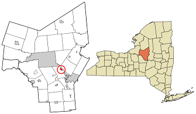
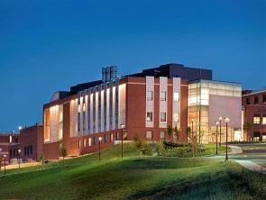
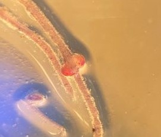

This is the location of my hometown, Oriskany.

I went to Le Moyne College in Syracuse, NY, where I received my B.S. in biological sciences. 

I am currently a fourth year PhD student in the microbiology program. I study the actinorhizal symbiosis, which is the mutualistic relationship that occurs between bacteria in the genus *Frankia* and their host plants.

